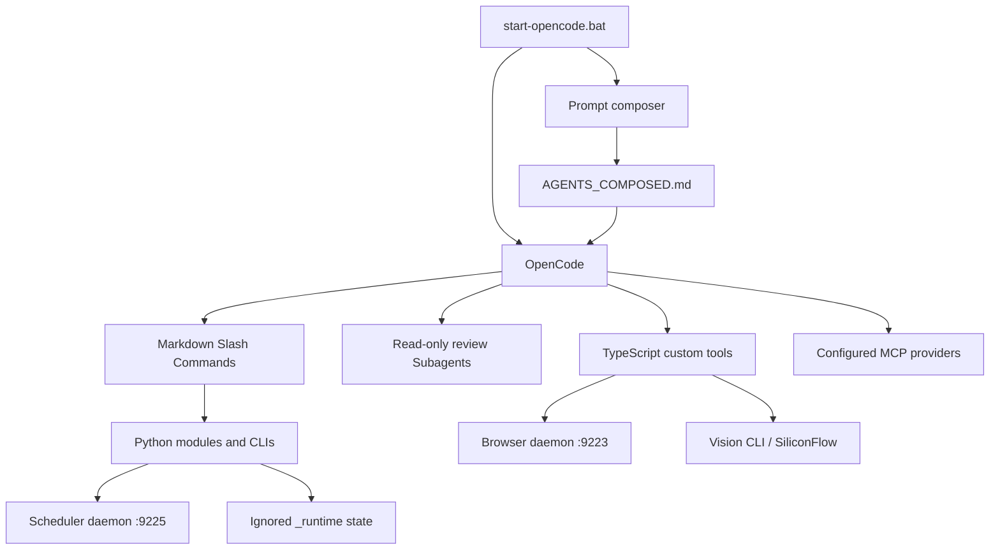

# AgentForge Architecture

Status date: 2026-08-02. This is the only maintained architecture reference.

## System boundary

AgentForge is a local OpenCode workspace, not a hosted application. OpenCode
owns the interactive agent runtime; this repository supplies instructions,
extension definitions, Python processes/libraries, and local-state conventions.

External boundaries include DeepSeek, SiliconFlow, GitHub, Context7, SearXNG,
Serper, arXiv, Semantic Scholar, npm/Python packages, Firefox, and optional
upstream skill repositories. Repository configuration cannot guarantee their
availability.

## Startup and configuration

`start-opencode.bat` resolves the repository from `%~dp0`, requires `python` on
`PATH`, reads ignored `markconfig/secrets.json`, exports four selected values,
composes `AGENTS_COMPOSED.md`, and starts OpenCode. It does not install packages
or start Browser/Scheduler daemons.

`opencode.json` selects two DeepSeek model identifiers, three plugin references,
project permissions, three instruction paths, and sixteen MCP definitions.

| MCP | State | Runtime |
|---|---|---|
| filesystem | enabled | npm; scoped to repository working directory |
| github | enabled | npm; inherited GitHub token when launcher provides one |
| context7 | enabled | remote Streamable HTTP endpoint |
| sequential-thinking | enabled | npm |
| memory | enabled | npm; ignored `_runtime/mcp-memory.json` |
| playwright | enabled | npm |
| fetch | enabled | `modules.mcp.fetch_mcp` |
| sqlite | enabled | `modules.mcp.sqlite_mcp`, read-only by default |
| time | enabled | `modules.mcp.time_mcp` |
| git | enabled | external `mcp_server_git` Python package |
| duckduckgo | disabled | retained external Python definition |
| searxng | enabled | npm; fixed public instance URL |
| g-search | disabled | retained npm rollback definition |
| serper | enabled | `modules.search.serper_mcp`; API key required |
| arxiv | enabled | `modules.search.arxiv_mcp` |
| semantic_scholar | enabled | `modules.search.semantic_scholar_mcp` |

Enabled is configuration state, not proof that packages, credentials, network,
or provider services are available.

## Prompt and policy plane

The composer assembles base, profile, task, context, and example layers, then
optionally appends the ignored local profile. It writes generated Prompt/runtime
metadata under ignored paths. `AGENTS.md` also contains direct routing rules;
routing is procedural rather than a central engine intercepting every message.

`modules.dispatch.guard` permits the small model for configured utility/review
categories and redirects or rejects configured implementation/planning tasks.

## Extension plane

- Commands: 11 Markdown procedures (`browser`, `collect`, `deliver`, `doctor`,
  `handoff`, `index`, `mode`, `prompt`, `review`, `schedule`, `search`).
- Review: 3 read-only Subagents with explicit PASS/FAIL score contracts.
- Tools: 1 Vision export and 9 Browser HTTP client exports.
- Skills: 6 repository-owned skills. This machine also exposes 67 ignored
  junctions from four external repositories; those contents are not portable
  repository assets.

Commands may invoke Python, but the Markdown file itself is interpreted by the
agent. `/deliver` and `/search` are therefore procedural coordinators.

## Python module plane

| Domain | Implemented responsibility | Important boundary |
|---|---|---|
| `bootstrap` | generate/static-validate nine TS/Vite config files | does not run npm/lint/type-check/tests |
| `browser` | visible persistent Firefox HTTP daemon | hard-coded Firefox/profile constants; explicit startup |
| `delivery` | six-category TS/Vite static checklist | heuristic; review pipeline is separate |
| `dispatch` | small/Pro model-role guard | network call optional |
| `integration_check` | five regex-based TS integration checks | not compiler/runtime analysis |
| `mcp` | fetch, SQLite, time JSON-RPC MCP servers | SQLite mutations disabled unless explicitly enabled |
| `memory` | atomic local lessons/ADR append and health report | library calls only; no registered automatic hook |
| `orchestrator` | collection, indexing, action extraction, schedule CRUD | browser-use branch unfinished; ChromaDB/API optional |
| `prompt` | composition, classification, contexts, experiments | classification model call optional |
| `scheduler` | localhost APScheduler HTTP service | stub without package; two incomplete job types |
| `search` | privacy/history/scoring/planning/aggregation/MCP helpers | live MCP callbacks not wired into orchestrator CLI |
| `ui_check` | five regex-based UI checks | convention-specific |
| `vision` | image/PDF recognition and clipboard adapter | PyMuPDF/Pillow operation-specific |

The tree contains 122 first-party module files: 102 Python files split evenly
between source and test locations, plus manifests/templates/rule data. This is
a point-in-time inventory, not a test-result claim.

## Key flows

### Search

`/search` reads current provider state, redacts outbound text, checks local
cache, calls applicable MCP tools, deduplicates/scores/verifies where inputs are
available, and writes dated history metadata. `SearchOrchestrator` models stage
order and accepts injected callbacks; its dry-run is a plan, while its default
CLI cannot independently call OpenCode MCP tools.

### Browser and collection

`/browser` starts `modules.browser.daemon`. Browser tools call only its localhost
HTTP API. Collection checks whether browser-use imports, but that branch returns
an explicit TODO error and then falls back to daemon navigation, a three-second
wait, screenshot, Vision recognition, aggregation, and atomic Markdown output.

### Vision

The TypeScript tool calls the Python CLI. Image data is base64 encoded; PDFs are
rendered to temporary page images before SiliconFlow requests. Usage metadata is
written under `_runtime/`, and temporary pages are cleaned up.

### Scheduling and memory

Schedule CRUD uses `_runtime/mcp-sqlite.db`. The Scheduler daemon separately
persists job definitions to `_runtime/scheduler/jobs.json`. Implemented jobs are
`file_reindex`, `report_collect`, `action_extract`, and whitelist-restricted
`custom`; `memory_review` is a success-labelled placeholder and
`pattern_extract` has no branch. Memory append helpers write ignored Markdown
only when another caller invokes them.

## Storage and privacy

| Path | Content | Git policy |
|---|---|---|
| `markconfig/secrets.json` | real tokens | ignored |
| `markconfig/profile.md` | personal profile | ignored |
| `_data/memory/MEMORY.md`, `user-*.md`, lessons/decisions | private/local memory | ignored |
| `_runtime/` | generated Prompt data, logs, cache, DBs, reports, handoffs | ignored |
| `vendor/`, `MindSearch/` | optional/disposable local source/dependency trees | ignored and absent from repository |
| external skill clones/junctions | upstream material | ignored |

Git exclusion is not encryption. Search redaction is regex-based and does not
guarantee removal of every sensitive value.

## Verification and portability

Most domains have tests under `tests/`; Browser and Vision do not have dedicated
test directories. This document asserts no passing test result.

Remaining portability/reproducibility gaps:

- Firefox executable/profile constants and two Search health-check Python
  executable probes remain Windows/machine specific; two test helper files
  also retain the original repository path.
- plugin and several npm MCP references are unpinned (`latest` or `npx -y`),
  as is the `mcp-server-git` Python package declaration.
- SearXNG uses a fixed public instance.
- external skill installation is not reproducible from a tracked installer.
- optional daemons require separate lifecycle management.
- no CI currently checks code, documentation counts, manifests, or secrets.
