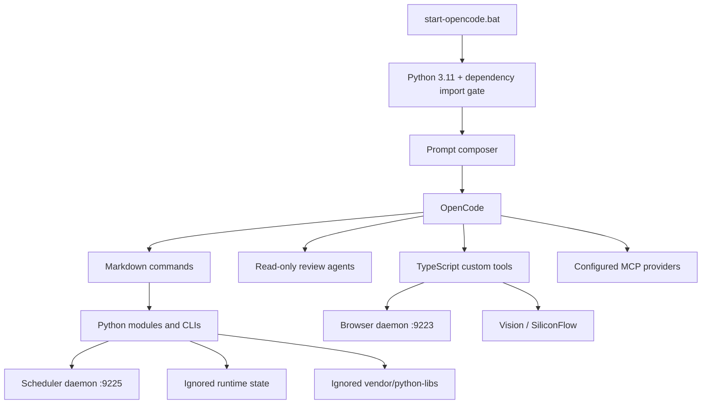

# AgentForge Architecture

Status date: 2026-08-02. This is the maintained architecture reference.

## System boundary

AgentForge is a local OpenCode workspace, not a hosted application. OpenCode
owns the interactive agent runtime; this repository supplies policy, extension
definitions, Python libraries/processes, and local-state conventions.

External boundaries include model/API providers, GitHub, Context7, SearXNG,
Serper, arXiv, Semantic Scholar, npm/PyPI, Chromium, and optional upstream skill
repositories. Configuration cannot guarantee external availability.

## Startup and dependency boundary

`start-opencode.bat` resolves the repository from `%~dp0`, selects `python` or
`AGENT_FORGE_PYTHON`, requires Python 3.11, prepends
`vendor/python-libs` to `PYTHONPATH`, performs real dependency imports, reads
ignored secrets without printing them, composes `AGENTS_COMPOSED.md`, and starts
OpenCode. It does not start Browser or Scheduler daemons.

`modules.bootstrap.dependencies` is the single Python dependency activation and
installation contract. Direct runtime requirements are pinned in
`requirements.txt`; the transitive environment is pinned in
`requirements.lock.txt`. Installations target ignored `vendor/python-libs` and
record the interpreter cache tag. Health is based on imports, not dist-info
presence, preventing empty namespace directories and wrong-ABI native modules
from appearing healthy.

## OpenCode extension plane

`opencode.json` defines two DeepSeek models, three plugin references, repository
permissions, three instruction paths, and sixteen MCPs.

| MCP | Configured state | Runtime |
|---|---|---|
| filesystem | enabled | npm, repository scope |
| github | enabled | npm, token inherited when exported |
| context7 | enabled | remote HTTP |
| sequential-thinking | enabled | npm |
| memory | enabled | npm, `_runtime/mcp-memory.json` |
| playwright | enabled | npm |
| fetch | enabled | `modules.mcp.fetch_mcp` |
| sqlite | enabled | `modules.mcp.sqlite_mcp`, read-only by default |
| time | enabled | `modules.mcp.time_mcp` |
| git | enabled | pinned `mcp-server-git` in local Python environment |
| duckduckgo | disabled | external Python definition retained |
| searxng | enabled | npm, fixed public URL |
| g-search | disabled | npm rollback definition |
| serper | enabled | project Python MCP, key required |
| arxiv | enabled | project Python MCP |
| semantic_scholar | enabled | project Python MCP |

Enabled means configured, not authenticated or reachable.

The extension tree contains 11 commands, 3 review agents, 2 TypeScript custom
tool files (10 exports), and 6 repository-owned skills. Ignored upstream skill
clones and junctions are not portable repository assets.

## Python domains

| Domain | Implemented responsibility | Boundary |
|---|---|---|
| `bootstrap` | dependency environment plus TS/Vite config generation/static validation | generation checks do not run npm/lint/tests |
| `browser` | loopback Playwright/Chromium context and HTTP API | explicit lifecycle; browser process is local |
| `delivery` | six-category TS/Vite static checklist | heuristic, project-convention specific |
| `dispatch` | model-role guard | model call optional |
| `integration_check` | regex-based TS integration checks | not compiler/runtime analysis |
| `mcp` | fetch, SQLite, and time JSON-RPC servers | SQLite mutation opt-in |
| `memory` | atomic lessons/ADRs, structural health, task review | explicit calls; private sources remain ignored |
| `orchestrator` | collection, Chroma index, action extraction, schedule storage | external keys/services still optional at operation time |
| `prompt` | composition, classification, contexts, experiments | classifier network call optional |
| `scheduler` | APScheduler HTTP service and atomic job persistence | separate from SQLite schedule records |
| `search` | privacy/history/scoring/planning/aggregation/MCP helpers | live OpenCode MCP callbacks are procedural |
| `ui_check` | regex-based UI conventions | not visual/runtime testing |
| `vision` | image/PDF recognition and clipboard adapter | SiliconFlow key/network required for recognition |

The current first-party module inventory is 124 files: 107 Python files (53
source and 54 tests) plus manifests/templates/rule data.

## Key flows

### Collection

`run_collection_pipeline` accepts only credential-free HTTP(S) URLs and selects
backends in this order:

1. browser-use Agent with BrowserUse, DeepSeek, or Anthropic-compatible LLM;
2. local Browser daemon navigation, screenshot, Vision, and aggregation;
3. bounded static HTTP fetch and aggregation.

The report records the successful backend. Degraded successes retain previous
backend errors. The daemon defaults to a Playwright-managed Chromium build,
persists cookie/local-storage state only on clean shutdown, binds loopback, and
enforces request-size, URL, generated-report, and screenshot path boundaries.

### Search

`/search` is a provider-aware model procedure. Search modules supply redaction,
cache/history, ranking, verification, aggregation, and injectable orchestration
callbacks. The default Python CLI cannot independently call OpenCode MCP tools;
its dry run is a plan rather than proof of live provider execution.

### Scheduling and Memory

SQLite schedule CRUD under `_runtime/mcp-sqlite.db` is distinct from timed jobs
under `_runtime/scheduler/jobs.json`. Scheduler job types are `file_reindex`,
`report_collect`, `memory_review`, `action_extract`, and exact-whitelist
`custom`. Without APScheduler, creation is refused rather than persisted as a
false-active job. Malformed persistence is preserved in a timestamped corrupt
backup.

Memory lessons and ADRs are atomic explicit writes. ADR allocation is protected
across local threads/processes. `review_memory` reads only explicit unchecked
tasks/TODO lines and writes an ignored report; it never modifies source memory.

## Storage and privacy

| Path | Content | Git policy |
|---|---|---|
| `markconfig/secrets.json` | real tokens | ignored |
| `markconfig/profile.md` | personal profile | ignored |
| `_data/memory/MEMORY.md`, `user-*.md`, lessons/decisions | private local memory | ignored |
| `_runtime/` | logs, cache, DBs, reports, handoffs, recovery evidence | ignored |
| `vendor/python-libs/` | reproducible local packages and ABI metadata | ignored |
| external skill clones/junctions | upstream material | ignored |

Git exclusion is not encryption. Search redaction is regex-based and cannot
guarantee removal of every sensitive value.

## Known architectural gaps

- several npm/plugin references remain runtime-resolved rather than locked;
- SearXNG is a fixed public instance;
- external skill clone/junction installation is not tracked;
- Browser and Scheduler lifecycle supervision remains manual;
- no CI currently runs the documented checks;
- broad Search provider retry/circuit-breaker behavior is not unified.
